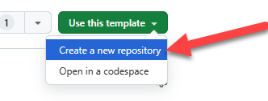
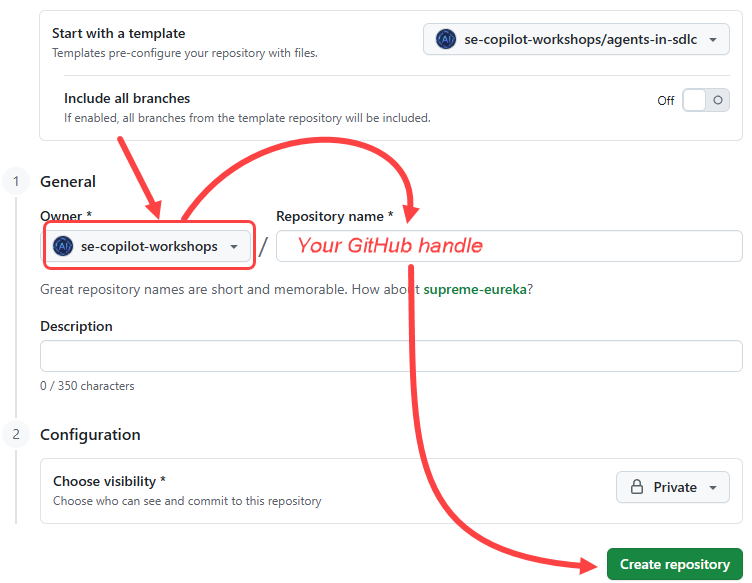
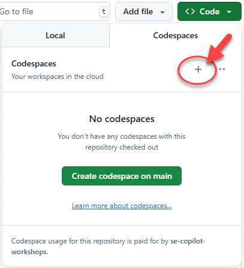

# Exercise 0: Prerequisites

Before we get started on the lab, there's a few tasks we need to complete to get everything ready. We need to get a copy of the repository which includes the code, then spin up a [codespace](https://github.com/features/codespaces) to use to create our code.

## Setting up the Lab Repository

To create a copy of the repository for the code you'll create an instance from the [template](https://docs.github.com/en/repositories/creating-and-managing-repositories/creating-a-template-repository). The new instance will contain all of the necessary files for the lab, and you'll use it as you work through the exercises. 

1. In a new browser window, navigate to the GitHub repository for this lab: `https://github.com/se-copilot-workshops/agents-in-sdlc`. You should sign into GitHub using your own GitHub handle.
2. Create your own copy of the repository by selecting the **Use this template** button on the lab repository page. Then select **Create a new repository**.

    

> [!IMPORTANT]
> Select **se-copilot-workshops** as the owner and use your GitHub handle for the repository name. 

3. Select **se-copilot-workshops** as the owner and name your GitHub handle for the repository name. This ensures you will get access to the Copilot coding agent and can assign issues to Copilot.

    

4. Click the **Create repository** button
5. Make a note of the repository path you created (**se-copilot-workshops/**___GHhandle___), as you will be referring to this later in the lab.

## Creating a codespace

Next up, we will be using a codespace to complete the lab exercises. [GitHub Codespaces](https://github.com/features/codespaces) are a cloud-based development environment that allows you to write, run, and debug code directly in your browser. It provides a fully-featured IDE with support for multiple programming languages, extensions, and tools.

1. Navigate to your newly created repository.
2. Select the green **Code** button.

    

3. Select the **Codespaces** tab and select the **+** button to create a new Codespace.
 (**TIP:** Keep reading ahead. Don't wait for the codespace to complete)

    

The creation of the codespace will take several minutes, although it's still far quicker than having to manually install all the services! That said, we can use this time to take advantage of our ability to assign tasks to GitHub Copilot which it can perform asynchronously, which we'll turn our attention to next!

## Summary

Congratulations, you have created a copy of the lab repository! You also began the creation process of your codespace, which you'll use when you begin writing code. We're going to return back to this after the next lesson, so don't worry.

## Next step

Since we've got a few minutes, let's get Copilot working on some tasks asynchronously for us! We can do this by creating issues and assigning them to Copilot coding agent. Click the following link to move onto the next exercise.
[Next exercise: Copilot Coding Agent](./1-copilot-coding-agent.md)
